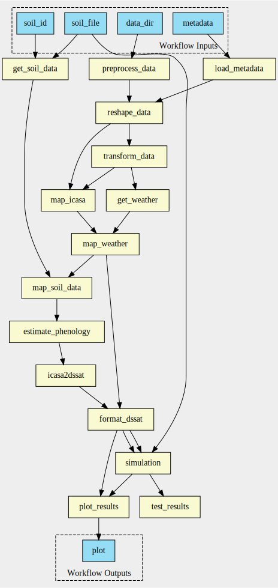

# ARC for UC6
In this repository, we will create an annotated research context [ARC](https://www.nfdi4plants.de/content/learn-more/annotated-research-context.html) with assays, studies, workflows and runs of these workflows for [Use Case 6](https://github.com/fairagro/uc6_csmTools/tree/main) of FAIRagro.
Use Case 6 deals with ETL functions for semiautomated data integration into crop simulation modelling.

The ARC contians a modularised [CWL](https://www.commonwl.org/) workflow that can be executed locally with [cwltool](https://github.com/common-workflow-language/cwltool). 
To facilitate writing CWL, a minimal templating system that helps to generate CWL will be used or developed. 
Once the finalised ARC has undergone a test to verify that the workflow is running as intended, it will also be made accessible via the PLANTdataHUB. 
The ARC will serve as a test case for the further development of a Scientific Workflow Infrastructure (SciWIn). 

### Usage
```bash
git clone https://github.com/fairagro/M4.4_UC6_ARC.git
cd runs
cwltool ../workflows/main.cwl main_inputs.yml
```

### Workflow
The Workflow contained in `main.cwl` is split into multiple small chunks. A visualisation can be found here:


